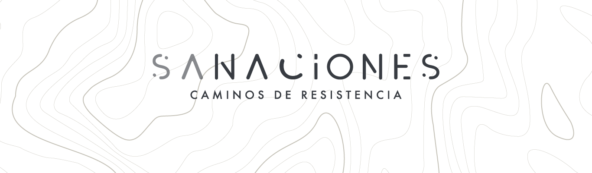

<picture>
  <source media="(prefers-color-scheme: dark)" srcset="./src/images/readme-dark.png">
  <source media="(prefers-color-scheme: light)" srcset="./src/images/readme-light.png">
  
</picture>

## SaNaciones - caminos de resistencia

>  Live demo <a href="https://mnmh.github.io/SaNaciones4/" target="_blank">https://mnmh.github.io/SaNaciones4/</a>

<p>Micrositio de la exposición </br>
Hecho con ❤️ por <a href="https://github.com/mnmh" target="_blank">Laboratorio digital</a>
</p>


### Prerequisites

>  Install <a href="https://nodejs.org/en/" target="_blank">Node.js</a>


### Installation 🚀

1. Clone the repo
   ```sh
   git clone https://github.com/mnmh/SaNaciones4.git
   ```
2. Install NPM packages
   ```sh
   npm install
   ```
3. Start project
   ```sh
   npm start
   ```
   :+1:
   
### Scripts

Deploy demo
   ```sh
   npm run deploy
   ```
ReInstall project
   ```sh
   npm run reinstall
   ```
Install package
   ```sh
   npm install --save-dev name-package
   ```
   
### Structure 

Folders + files
   ```sh
   .
├── dist               # Compiled dev files
├── public             # Compiled prod files
├── src                # Source files
│   ├── fonts
│   ├── images
│   ├── js
│   ├── styles         # SASS files
│   └── .html          # .html files +
├── package.json
└── README.md
   ```

### Built With 

- <a href="https://nodejs.org/en/" target="_blank">Node.js</a>
- NPM
- <a href="https://parceljs.org/" target="_blank">Parcel.js</a>
- HTML
- Javascript
- SASS
